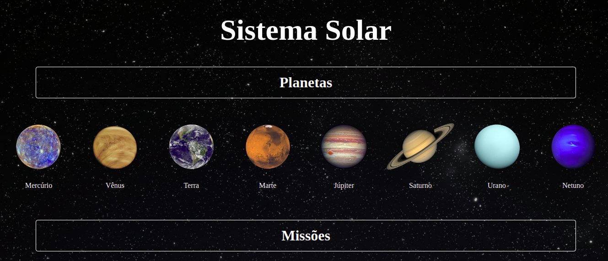

Este projeto foi desenvolvido por **Viviane Puga**, como parte do programa de estudos da **Trybe**

## Habilidades desenvolvidas

  * Utilizar JSX no React
  * Utilizar corretamente o método `render()` para renderizar seus componentes
  * Utilizar `import` para trazer componentes em diferentes arquivos
  * Criar componentes de classe em React
  * Criar múltiplos componentes a partir de um array
  * Fazer uso de `props` corretamente
  * Fazer uso de `PropTypes` para validar as `props de um componente`

Neste primeiro projeto de Front-End, desenvolvi uma aplicação em React com criação de componentes de classe e passagem de props. Essa aplicação simula uma visualização do **Sistema Solar**, bem como informações sobre diversas missões espacias que ocorreram ao longo da história.
